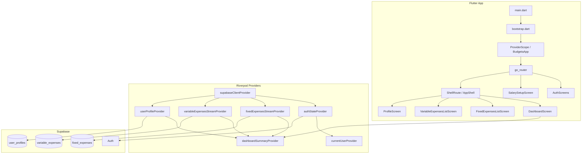

# Budgeta — Architecture

## Overview
Budgeta is a multi-platform Flutter app backed by Supabase. Users authenticate, set a monthly salary, define fixed recurring expenses, log daily variable expenses, and view a real-time dashboard showing remaining balance and daily budget.

## Component Table

| Component | Location | Responsibility |
|---|---|---|
| App bootstrap | `lib/bootstrap.dart` | Supabase init, ProviderScope |
| Router | `lib/core/router/app_router.dart` | Auth guards, redirect logic, bottom nav shell |
| Auth feature | `lib/features/auth/` | Login, register, session state |
| Profile feature | `lib/features/profile/` | Salary setup, profile editing |
| Fixed expenses | `lib/features/fixed_expenses/` | Recurring bill CRUD + real-time stream |
| Variable expenses | `lib/features/variable_expenses/` | Daily expense CRUD + real-time stream |
| Dashboard | `lib/features/dashboard/` | Pure derived summary — no direct DB access |
| Core | `lib/core/` | Theme, constants, widgets, utils, providers |
| Supabase migrations | `supabase/migrations/` | Schema, RLS, triggers |

## Architecture Diagram



## Provider Dependency Map

```
supabaseClientProvider
├── authStateProvider (stream)
│   └── currentUserProvider (derived)
│       ├── authRepositoryProvider
│       ├── fixedExpensesRepositoryProvider
│       ├── variableExpensesRepositoryProvider
│       └── profileRepositoryProvider
├── fixedExpensesStreamProvider (stream → Supabase realtime)
├── variableExpensesStreamProvider (stream → Supabase realtime, filtered by selectedMonthProvider)
└── userProfileProvider (future)

dashboardSummaryProvider (DERIVED — synchronous, no async)
├── watches: userProfileProvider
├── watches: fixedExpensesStreamProvider  
└── watches: variableExpensesStreamProvider
```

## Coupling Map

| Module | Depends On | Must NOT depend on |
|---|---|---|
| `core/` | Nothing (leaf) | Any feature |
| `auth/` | `core/` | Other features |
| `profile/` | `core/`, `auth/` | `dashboard/`, expense features |
| `fixed_expenses/` | `core/`, `auth/` | `dashboard/`, `variable_expenses/` |
| `variable_expenses/` | `core/`, `auth/` | `dashboard/`, `fixed_expenses/` |
| `dashboard/` | `core/`, `auth/`, all features | Nothing |

Dashboard is allowed to read from all features via providers. No feature reads from dashboard.

## Key Design Decisions

**Real-time via StreamProvider** — Supabase `.stream()` emits `Stream<List<Map>>`. Wrapping in Riverpod `StreamProvider` gives automatic subscription lifecycle management.

**dashboardSummaryProvider is synchronous** — It derives from three already-loaded providers. No async needed. If upstream is loading, dashboard shows a skeleton.

**Salary gate in router** — `salary == null` redirects to setup screen before dashboard. Guarantees the formula always has valid input.

**`is_active` toggle (soft disable)** — Fixed expenses can be deactivated without deletion. Only active ones contribute to balance. Useful for seasonal/suspended bills.

**No `withOpacity`→`withValues` migration** — Project targets Dart 3.5.3 / Flutter < 3.27. `withValues()` is not available; always use `withOpacity()`.
